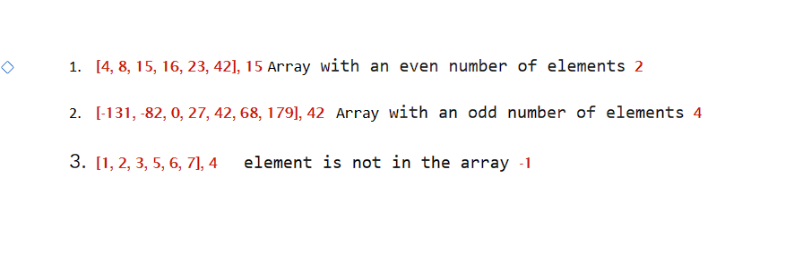

# Array Binary Search

----

**_Problem Domain_:**

> * Write a function called BinarySearch which takes in 2 parameters: a sorted array and the search key. Without utilizing any of the built-in methods available to your language, return the index of the array’s element that is equal to the value of the search key, or -1 if the element is not in the array.

>Input: Array, value
Output: value   (index of the array’s element that is equal to the value of the search key)

----

**_Visualization & Test cases_:**



----

**_Algorithm_:**

*  function called BinarySearch which takes in 2 parameters: a sorted array and the search key
 *  Calculate the midpoint and compare the value at that index with the search key. 
* If they are equal, the function returns the index.
*  If the value at midpoint is less than the search key, the start pointer is shifted to mid + 1 to search in the right half of the array.
* If the value at midpoint is greater, the end pointer is shifted to mid - 1 to search in the left half of the array. 
* function returns -1 if the element is not in the array.

**This implementation only works with sorted arrays.**

----

**_Big O_**

Big O = O(log n), where n is the size of the input array.

----

**_Code_:**

```javascript

function BinarySearch(arr, key) {
  let start = 0;
  let end = arr.length - 1;
  while (start <= end) {
    let mid = Math.floor((start + end) / 2);
    if (arr[mid] === key) {
      return mid;
    } else if (arr[mid] < key) {
      start = mid + 1;
    } else {
      end = mid - 1;
    }
  }
  return -1;
}

```