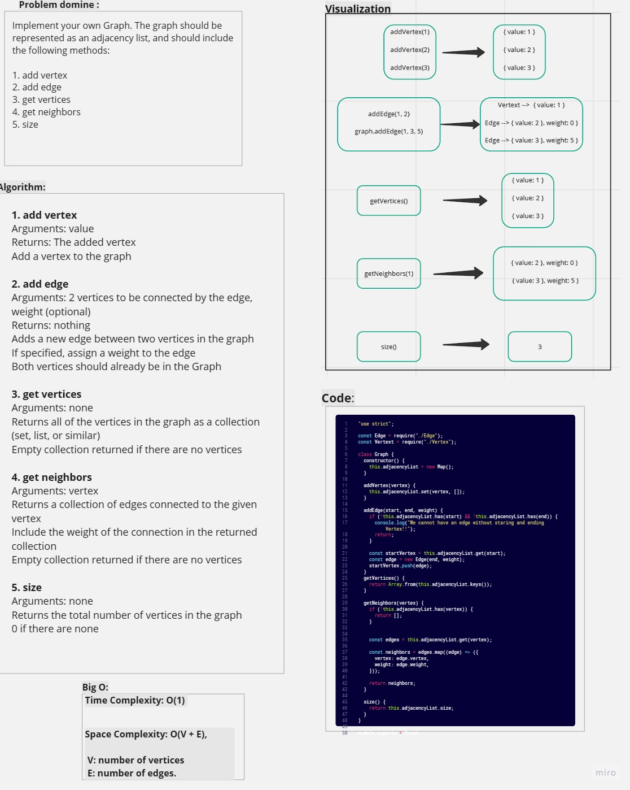
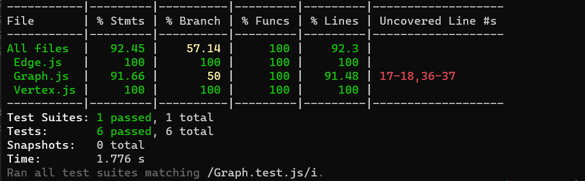

# Graphs


### Description

> Graph, which is a non-linear data structure that can be looked at as a collection of vertices connected by line segments named edges. We have a Directed Graphs: graph where every edge is directed and Undirected Graph: is a graph where each edge is undirected or bi-directional.

----

### Whiteboard



----

### Code

```javascript
"use strict";

const Edge = require("./Edge");
const Vertext = require("./Vertex");

class Graph {
  constructor() {
    this.adjacencyList = new Map();
  }

  addVertex(vertex) {
    this.adjacencyList.set(vertex, []);
  }

  addEdge(start, end, weight) {
    if (!this.adjacencyList.has(start) && !this.adjacencyList.has(end)) {
      console.log("We cannot have an edge without staring and ending Vertex!!");
      return;
    }

    const startVertex = this.adjacencyList.get(start);
    const edge = new Edge(end, weight);
    startVertex.push(edge);
  }
  getVertices() {
    return Array.from(this.adjacencyList.keys());
  }

  getNeighbors(vertex) {
    if (!this.adjacencyList.has(vertex)) {
      return [];
    }


    const edges = this.adjacencyList.get(vertex);

    const neighbors = edges.map((edge) => ({
      vertex: edge.vertex,
      weight: edge.weight,
    }));

    return neighbors;
  }

  size() {
    return this.adjacencyList.size;
  }
}

module.exports = Graph;

```

----

### Testing 

```javascript
const Graph = require("./Graph.js");
const Vertex = require("./Vertex");

describe("Graph", () => {
  let graph;

  beforeEach(() => {
    graph = new Graph();
  });

  it("should add a vertex to the graph", () => {
    const vertex = new Vertex(1);
    graph.addVertex(vertex);
    expect(graph.getVertices()).toContain(vertex);
  });

  it("should add an edge to the graph", () => {
    const v1 = new Vertex(1);
    const v2 = new Vertex(2);
    graph.addVertex(v1);
    graph.addVertex(v2);
    graph.addEdge(v1, v2, 5);
    const neighbors = graph.getNeighbors(v1);
    expect(neighbors).toContainEqual({ vertex: v2, weight: 5 });
  });

  it("should retrieve all vertices from the graph", () => {
    const vertices = [new Vertex(1), new Vertex(2), new Vertex(3)];
    vertices.forEach((vertex) => graph.addVertex(vertex));
    const allVertices = graph.getVertices();
    expect(allVertices).toEqual(expect.arrayContaining(vertices));
  });

  it("should retrieve appropriate neighbors with weights", () => {
    const v1 = new Vertex(1);
    const v2 = new Vertex(2);
    graph.addVertex(v1);
    graph.addVertex(v2);
    graph.addEdge(v1, v2, 5);
    const neighbors = graph.getNeighbors(v1);
    expect(neighbors).toContainEqual({ vertex: v2, weight: 5 });
  });

  it("should return the proper size of the graph", () => {
    const vertices = [new Vertex(1), new Vertex(2), new Vertex(3)];
    vertices.forEach((vertex) => graph.addVertex(vertex));
    expect(graph.size()).toBe(vertices.length);
  });

  it("should work with a graph with one vertex and one edge", () => {
    const v1 = new Vertex(1);
    graph.addVertex(v1);
    graph.addEdge(v1, v1, 5);

    const allVertices = graph.getVertices();
    const neighbors = graph.getNeighbors(v1);
    const numberOfVertices = graph.size();

    expect(allVertices).toEqual([v1]);
    expect(neighbors).toContainEqual({ vertex: v1, weight: 5 });
    expect(numberOfVertices).toBe(1);
  });
});

```

**Testing result:**



----
