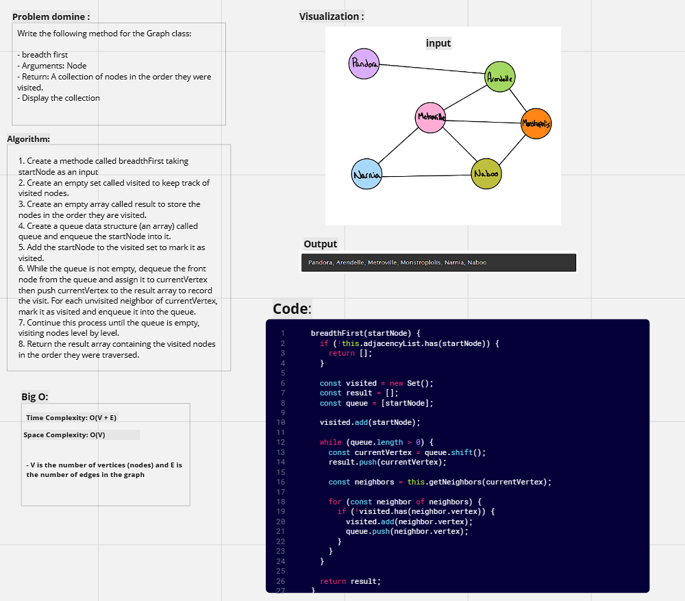
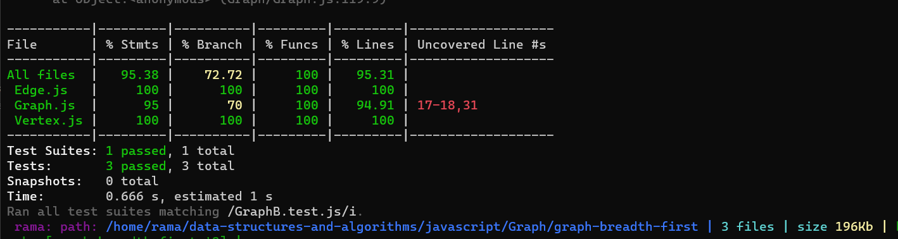

# Graph-breadth-first

---

#### Description

Write the following method for the Graph class:

* breadth first
* Arguments: Node
* Return: A collection of nodes in the order they were visited.
* Display the collection

----

####  Whiteboard:



----

#### Approach & Efficiency:

>**Big O**
>Time : O(V + E) 
Space :  O(V)
> - V is the number of vertices (nodes) and E is the number of edges in the graph


----

#### Solution:

```javascript
breadthFirst(startNode) {
    if (!this.adjacencyList.has(startNode)) {
      return [];
    }

    const visited = new Set();
    const result = [];
    const queue = [startNode];

    visited.add(startNode);

    while (queue.length > 0) {
      const currentVertex = queue.shift();
      result.push(currentVertex);

      const neighbors = this.getNeighbors(currentVertex);

      for (const neighbor of neighbors) {
        if (!visited.has(neighbor.vertex)) {
          visited.add(neighbor.vertex);
          queue.push(neighbor.vertex);
        }
      }
    }

    return result;
  }
```
---

#### Testing: 

