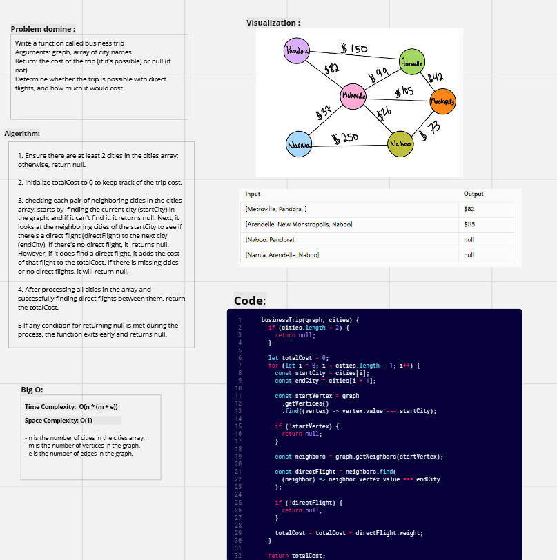
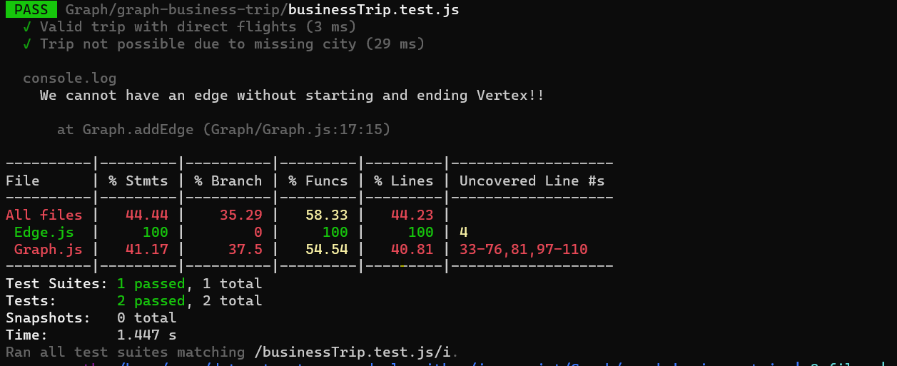

# graph-business-trip

---

#### Description

Write a function called business trip

* Arguments: graph, array of city names
* Return: the cost of the trip (if it’s possible) or null (if not)
* Determine whether the trip is possible with direct flights, and how much it would cost.

----

####  Whiteboard:



----

#### Approach & Efficiency:

>**Big O**
>Time :  O(n * (m + e))
Space : O(1)
> * n is the number of cities in the cities array.
> * m is the number of vertices in the graph.
> * e is the number of edges in the graph.


----

#### Solution:

```javascript
  businessTrip(graph, cities) {
    if (cities.length < 2) {
      return null;
    }

    let totalCost = 0;
    for (let i = 0; i < cities.length - 1; i++) {
      const startCity = cities[i];
      const endCity = cities[i + 1];

      const startVertex = graph
        .getVertices()
        .find((vertex) => vertex.value === startCity);

      if (!startVertex) {
        return null;
      }

      const neighbors = graph.getNeighbors(startVertex);

      const directFlight = neighbors.find(
        (neighbor) => neighbor.vertex.value === endCity
      );

      if (!directFlight) {
        return null;
      }

      totalCost = totalCost + directFlight.weight;
    }

    return totalCost;
  }

```
---

#### Testing: 

