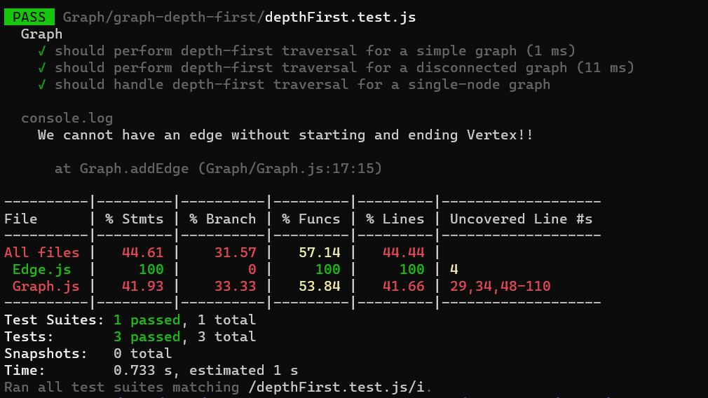

# Graph-depth-first

---

#### Description

Write the following method for the Graph class:

* Name: Depth first
* Arguments: Node (Starting point of search)
* Return: A collection of nodes in their pre-order depth-first traversal order
* Program output: Display the collection

----

####  Whiteboard:


----

#### Approach & Efficiency:

>**Big O**
>Time : O(n) 
Space :  O(n)


----

#### Solution:

```javascript
 depthFirst(node) {
    const visitedNode = new Set();
    const result = [];

    const travers = (current) => {
      visitedNode.add(current);
      result.push(current);

      const neighbors = this.getNeighbors(current);
      for (const neighbor of neighbors) {
        if (!visitedNode.has(neighbor.vertex)) {
          travers(neighbor.vertex);
        }
      }
    };

    travers(node);

    return result.join(",");
  }
```
---

#### Testing: 

