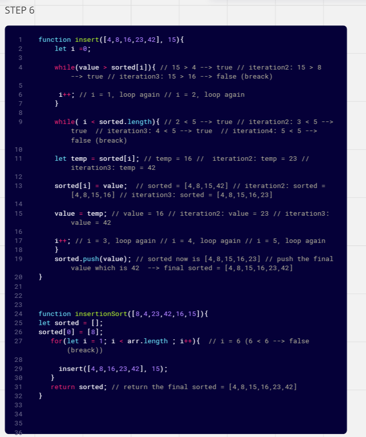

# Insertion Sort

----

### Code:

```javascript
'use strict';

function insertionSort(arr) {
  let sorted = [];
  sorted[0] = arr[0];

  for (let i = 1; i < arr.length; i++) {
    insert(sorted, arr[i]);
  }
  return sorted;
}


function insert(sorted, value) {
  let i = 0;

  while (value > sorted[i]) {
    i++;
  }

  while (i < sorted.length) {
    let temp = sorted[i];
    sorted[i] = value;
    value = temp;
    i++;
  }

  sorted.push(value);
}


module.exports = {
  insertionSort
};


```
----

### Testing:

```javascript
let {insertionSort} = require('./index');

describe('Sorted Insertion', () => {


  it('Returns a sorted array from the input array', () => {

    expect(insertionSort([8,4,23,42,16,15])).toEqual([ 4, 8, 15, 16, 23, 42 ]);
  });
});

```

---

### Tracing the pseudoCode


* Step 1:


* Step 2:


* Step 3:


* Step 4:


* Step 5:


* Step 6: return the final sorted array


----

### Big O

* Time Complexity: O(n^2), where n is the length of the input array.

* Space Complexity: where n is the length of the input array arr.