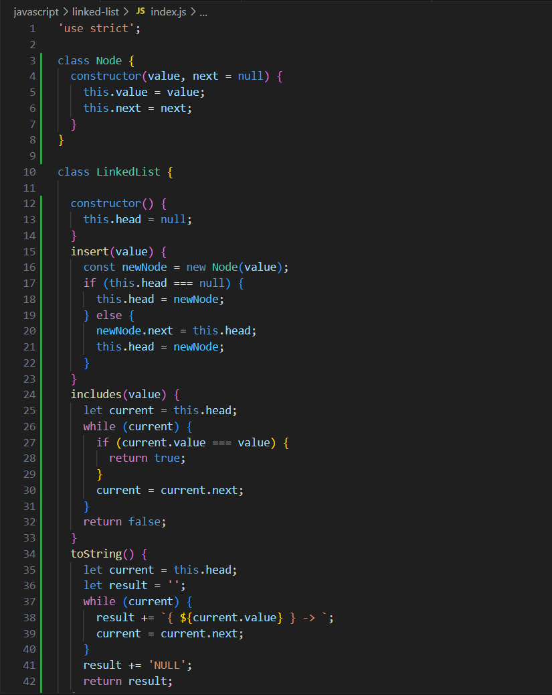
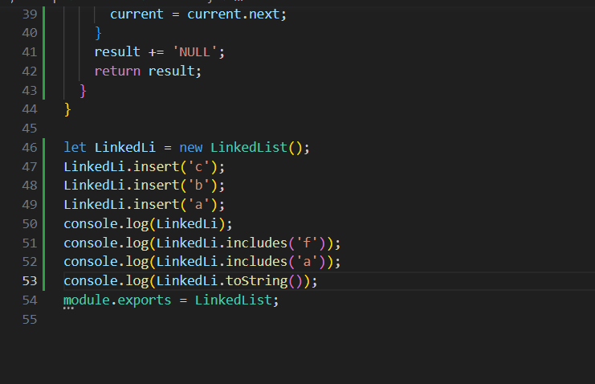
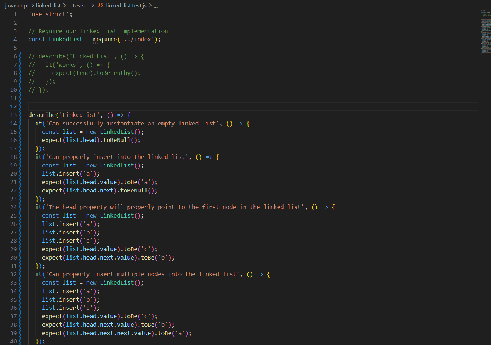
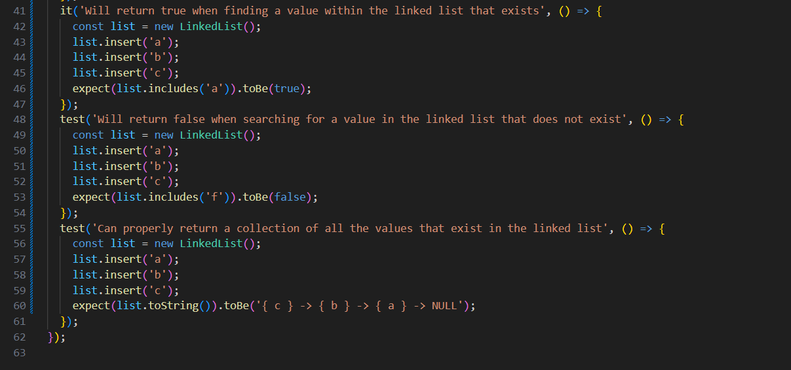

# Linked List

----

**_Problem Domain_:**

> * Implementation for Singly Linked Lists, by create Node class that have value and pointer (next) as an arguments, then create another class called LinkedList include a head property. LinkedList class contain different methods, one of them adds a new node with that value to the head of the list, the second method indicates whether that value exists as a Node’s value somewhere within the list and the last one  return a string representing all the values in the Linked List. 

----

**_Algorithm_:**

1. Create a Node class that has properties for the value stored in the Node, and a pointer to the next Node.
2. Create a Linked List class, include a head property within this class.Upon instantiation, an empty Linked List should be created.
3. Add insert method to Linked list class that takes a value as an Argument and Adds a new node with that value to the head of the list with an O(1) Time performance.
4. Add includes method to Linked list class that takes a value as an Argument and Indicates whether that value exists as a Node’s value somewhere within the list.
5. Add toString method to Linked list class that returns a string representing all the values in the Linked List, formatted as:
"{ a } -> { b } -> { c } -> NULL"

----

**_Code_:**
>

----

**_Testing code_**

>

* To run the test, go to the directory of the challenge then type npm test on the terminal.