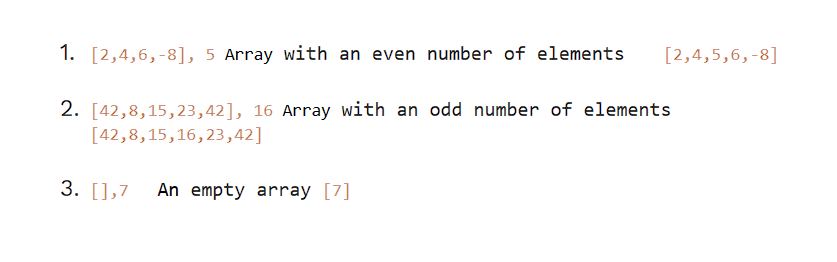
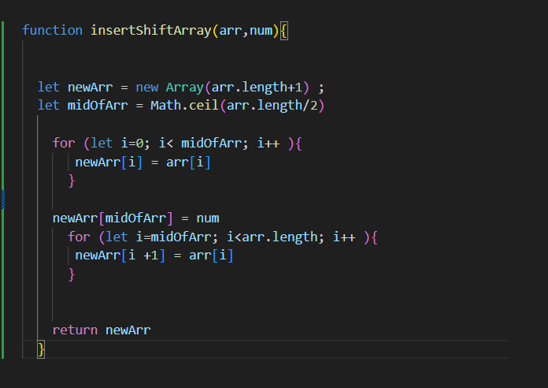

# Array insert shift

----

**_Problem Domain_:**

> * Function called insertShiftArray which takes in an array and a value to be added. Without utilizing any of the built-in methods available to your language, return an array with the new value added at the middle index.

>Input: Array, value
Output: Array (the inputted value in the middle index of the inputted array)
---

**_Visualization & Test cases_:**

---

**_Algorithm_:**

1. Function called insertShiftArray which takes in an array and a value to be added
2. Create a new array called newArr
3. Find the middle index for the inputted array
4. Iterate over the elements of the input array. If the current index is less than the middle index, copy the element to the new array with the same index.If the current index equals the middle index, insert the new number value into the new array. If the current index is greater than the middle index, copy the element into the new array at the next index.
5. Return newArr

---

**_Code_:**

