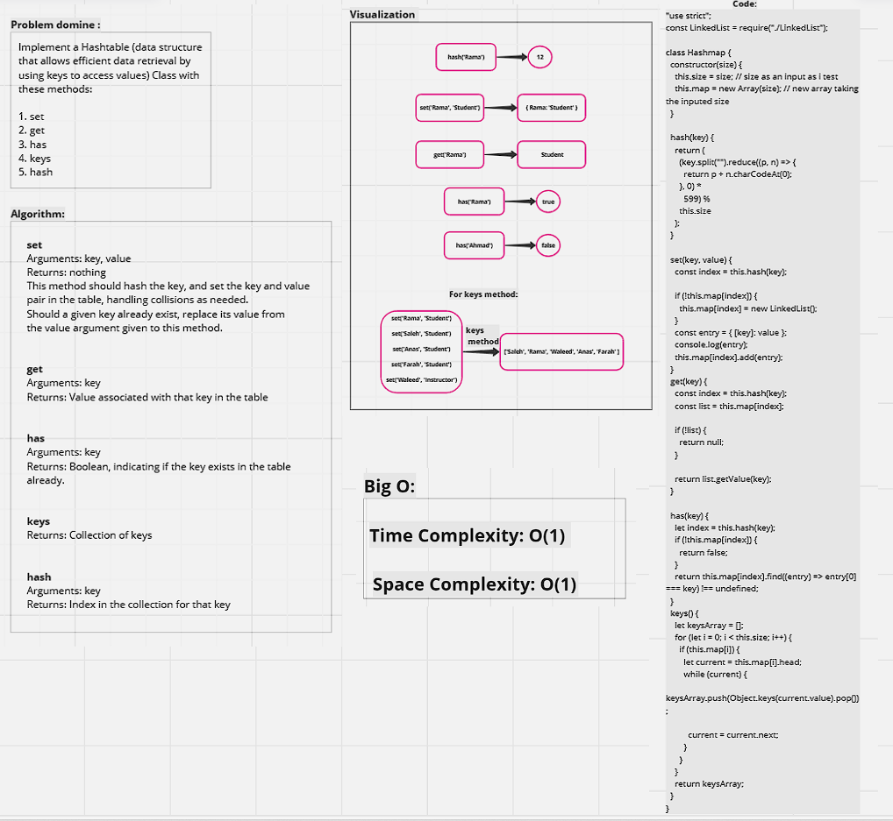
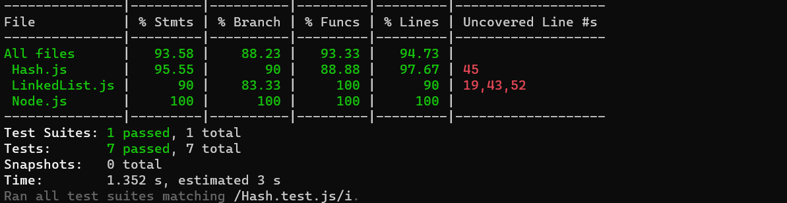

# Hash Table Implementation


### Description

>  Hash-table which is also known as a hash map, is a data structure that uses a hash function to store and retrieve data quickly. It organizes data into an array-like structure, assigning each data element a unique index based on its hash value. This enables efficient retrieval by directly accessing the corresponding index, reducing the need for sequential searches.

----

### Whiteboard



----

### Code

```javascript

"use strict";

const LinkedList = require("./LinkedList");

class Hashmap {
  constructor(size) {
    this.size = size; // size as an input as i test
    this.map = new Array(size); // new array taking the inputed size
  }

  hash(key) {
    return (
      (key.split("").reduce((p, n) => {
        return p + n.charCodeAt(0);
      }, 0) *
        599) %
      this.size
    );
  }

  set(key, value) {
    const index = this.hash(key);

    if (!this.map[index]) {
      this.map[index] = new LinkedList();
    }
    const entry = { [key]: value };
    console.log(entry);
    this.map[index].add(entry);
  }
  get(key) {
    const index = this.hash(key);
    const list = this.map[index];

    if (!list) {
      return null;
    }

    return list.getValue(key);
  }

  has(key) {
    let index = this.hash(key);
    if (!this.map[index]) {
      return false;
    }
    return this.map[index].find((entry) => entry[0] === key) !== undefined;
  }
  keys() {
    let keysArray = [];
    for (let i = 0; i < this.size; i++) {
      if (this.map[i]) {
        let current = this.map[i].head;
        while (current) {
          keysArray.push(Object.keys(current.value).pop());

          current = current.next;
        }
      }
    }
    return keysArray;
  }
}
module.exports = Hashmap;
const HashTable = new Hashmap(19);

console.log(HashTable.hash("Rama")); // Rama saved --> index 12

HashTable.set("Basha", "Student");
HashTable.set("Saleh", "Student");
HashTable.set("Anas", "Student");
HashTable.set("Farah", "Student");
HashTable.set("Rama", "Student");
HashTable.set("Waleed", "Instructor");
// HashTable.get("Saleh")
const allKeys = HashTable.keys();
console.log("hello", allKeys);
console.log(HashTable.get("Saleh"));
console.log(HashTable.has("Saleh"));
// console.log(HashTable.has("soso"));
HashTable.map.forEach((data, i) => {
  console.log(i, data && data.values());
});

```

----

### Testing 

```javascript
const Hashmap = require('./Hash');

describe('Hashmap Tests', () => {
  let HashTable;

  beforeEach(() => {
    HashTable = new Hashmap(19);
  });

  test('1. Setting a key/value to the hashtable', () => {
    HashTable.set('Ahmed', 'Student');
    expect(HashTable.get('Ahmed')).toBe('Student');
  });

  test('2. Retrieving value based on a key', () => {
    HashTable.set('Ali', 'Instructor');
    expect(HashTable.get('Ali')).toBe('Instructor');
  });

  test('3. Returning null for a key that does not exist', () => {
    expect(HashTable.get('NonExistent')).toBeNull();
  });

  test('4. Returning a list of all unique keys', () => {
    HashTable.set('Basha', 'Student');
    HashTable.set('Saleh', 'Student');
    HashTable.set('Anas', 'Student');
    const keys = HashTable.keys();
    expect(keys).toEqual(expect.arrayContaining(['Basha', 'Saleh', 'Anas']));
  });

  test('5. Handling collision within the hashtable', () => {
    HashTable.set('Ali', 'Instructor');
    HashTable.set('Amir', 'Instructor');
    expect(HashTable.get('Ali')).toBe('Instructor');
    expect(HashTable.get('Amir')).toBe('Instructor');
  });

  test('6. Retrieving value from a bucket with collision', () => {
    HashTable.set('Rami', 'Student');
    HashTable.set('Amir', 'Instructor');
    expect(HashTable.get('Rami')).toBe('Student');
    expect(HashTable.get('Amir')).toBe('Instructor');
  });

  test('7. Hashing key to an in-range value', () => {
    const hashedIndex = HashTable.hash('Rama');
    expect(hashedIndex).toBeGreaterThanOrEqual(0);
    expect(hashedIndex).toBeLessThan(HashTable.size);
  });
});
```

**Testing result:**




----

**Note: joint effort between laith and Rama**