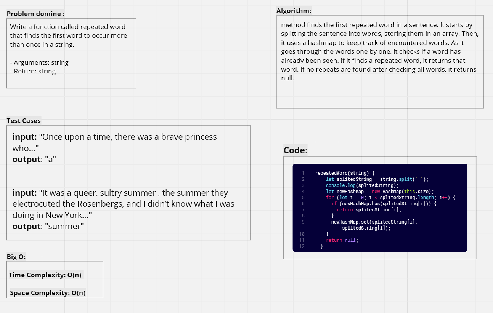
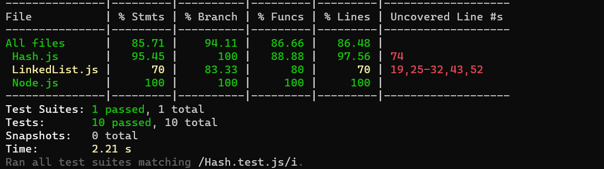

# Hashmap-repeated-word

----

**WhiteBoard:**



----

**Code:** 

```javascript

  repeatedWord(string) {
    let splitedString = string.split(" ");
    console.log(splitedString);
    let newHashMap = new Hashmap(this.size);
    for (let i = 0; i < splitedString.length; i++) {
      if (newHashMap.has(splitedString[i])) {
        return splitedString[i];
      }
      newHashMap.set(splitedString[i], splitedString[i]);
    }
    return null;
  }

```

----

**Testing:**

```javascript

describe("Hashmap repeatedWord method", () => {
  test("Finds the first repeated word in a sentence", () => {
    const sentence = "Once upon a time, there was a brave princess who...";
    let HashTable = new Hashmap(19);
    const result = HashTable.repeatedWord(sentence);
    expect(result).toBe("a");
  });

  test("Finds the first repeated word in a long text", () => {
    const text =
      "It was the best of times, it was the worst of times, it was...";
    let HashTable = new Hashmap(19);
    const result = HashTable.repeatedWord(text);
    expect(result).toBe("it");
  });

  test("Finds the first repeated word in a different sentence", () => {
    const sentence =
      "It was a queer, sultry summer , the summer they electrocuted the Rosenbergs...";
    let HashTable = new Hashmap(19);
    const result = HashTable.repeatedWord(sentence);
    expect(result).toBe("summer");
  });
});

```
----

