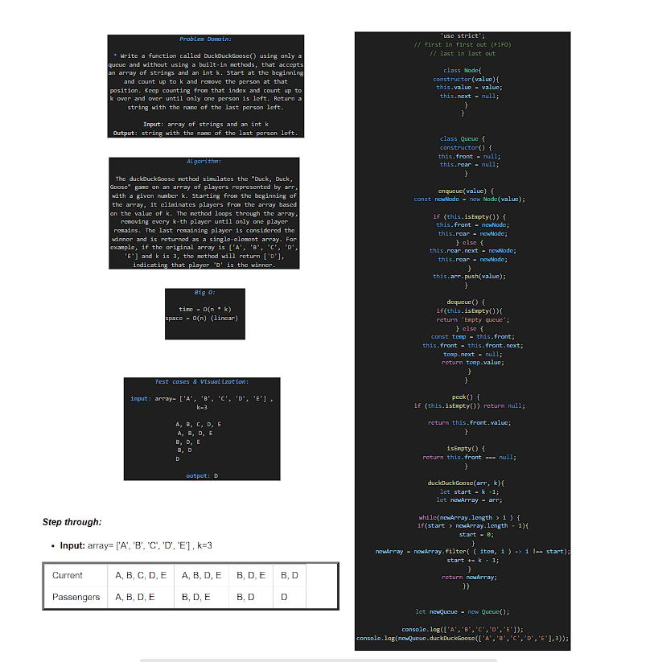

# Interview 03

----

**_Problem Domain_:**

 * Write a function called DuckDuckGoose() using only a queue and  without using a built-in methods ,that accepts an array of strings and an int k. Start at the beginning and count up to k and remove the person at that position. Keep counting from that index and count up to k over and over until only one person is left. Return a string with the name of the last person left.

>Input: array of strings and an int k
Output: string with the name of the last person left.

----

**_Test cases & Visualization_:**

**input:** array= ['A', 'B', 'C', 'D', 'E'] , k=3

A, B, C, D, E  
A, B, D, E     
B, D, E        
B, D           
D              

**output:** D

----

**_Algorithm_:**

The duckDuckGoose method simulates the "Duck, Duck, Goose" game on an array of players represented by arr, with a given number k. Starting from the beginning of the array, it eliminates players from the array based on the value of k. The method loops through the array, removing every k-th player until only one player remains. The last remaining player is considered the winner and is returned as a single-element array. For example, if the original array is ['A', 'B', 'C', 'D', 'E'] and k is 3, the method will return ['D'], indicating that player 'D' is the winner.

----

**_Big O_**

time = O(n * k) 
space = O(n) (linear)  

----
**_Code_:**

```javascript
'use strict';
// first in first out (FIFO)
// last in last out

class Node{
  constructor(value){
    this.value = value;
    this.next = null;
  }
}


class Queue {
  constructor() {
    this.front = null;
    this.rear = null;
  }

  enqueue(value) {
    const newNode = new Node(value);

    if (this.isEmpty()) {
      this.front = newNode;
      this.rear = newNode;
    } else {
      this.rear.next = newNode;
      this.rear = newNode;
    }
    this.arr.push(value);
  }

  dequeue() {
    if(this.isEmpty()){
      return 'Empty queue';
    } else {
      const temp = this.front;
      this.front = this.front.next;
      temp.next = null;
      return temp.value;
    }
  }

  peek() {
    if (this.isEmpty()) return null;

    return this.front.value;
  }

  isEmpty() {
    return this.front === null;
  }

  duckDuckGoose(arr, k){
    let start = k -1;
    let newArray = arr;

    while(newArray.length > 1 ) {
      if(start > newArray.length - 1){
        start = 0;
      }
      newArray = newArray.filter( ( item, i ) => i !== start);
      start += k - 1;
    }
    return newArray;
  }}


let newQueue = new Queue();

console.log(['A','B','C','D','E']);
console.log(newQueue.duckDuckGoose(['A','B','C','D','E'],3));
```

----

**_Step through:_**

* **Input:** array= ['A', 'B', 'C', 'D', 'E'] , k=3


<table border='4'>
        <tbody>
            <tr>
                <td>Current</td>
                <td>A, B, C, D, E</td>
                <td>A, B, D, E</td>
                <td>B, D, E</td>
                <td>B, D</td>
            </tr>
            <tr>
                <td>Passengers</td>
                <td>A, B, D, E</td>
                <td>B, D, E</td>
                <td>B, D</td>
                <td>D</td>
            </tr>
        </tbody>
    </table>


----


### whiteboard

