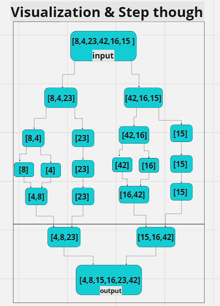
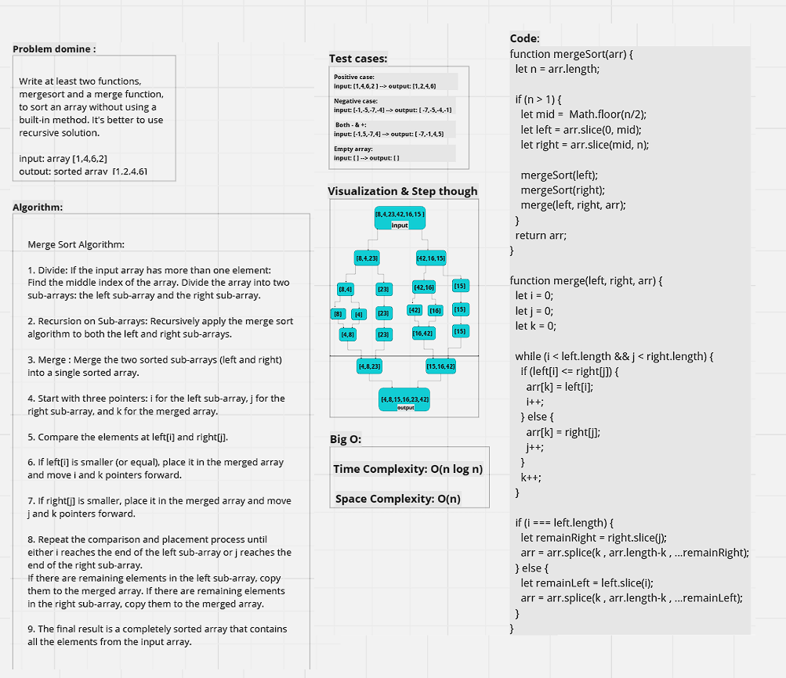

# Mock Interview

---

## Mergesort:

---

**Problem domine :**

> Write at least two functions, mergesort and a merge function, to sort an array without using a built-in method. It's better to use recursive solution.

input: array [1,4,6,2]
output: sorted array  [1,2,4,6]

---

**Test cases:**

* Positive case: 
input: [1,4,6,2 ] --> output: [1,2,4,6]

* Negative case: 
input: [-1,-5,-7,-4] --> output: [ -7,-5,-4,-1]

 * Both - & +: 
input: [-1,5,-7,4] --> output: [ -7,-1,4,5]

* Empty array: 
input: [ ] --> output: [ ]

---

**Visualization & Step though:**



---

**Algorithm:**

Merge Sort Algorithm:

1. Divide: If the input array has more than one element:
Find the middle index of the array. Divide the array into two sub-arrays: the left sub-array and the right sub-array.

2. Recursion on Sub-arrays: Recursively apply the merge sort algorithm to both the left and right sub-arrays.

3. Merge : Merge the two sorted sub-arrays (left and right) into a single sorted array.

4. Start with three pointers: i for the left sub-array, j for the right sub-array, and k for the merged array.

5. Compare the elements at left[i] and right[j].

6. If left[i] is smaller (or equal), place it in the merged array and move i and k pointers forward.

7. If right[j] is smaller, place it in the merged array and move j and k pointers forward.

8. Repeat the comparison and placement process until either i reaches the end of the left sub-array or j reaches the end of the right sub-array.
If there are remaining elements in the left sub-array, copy them to the merged array. If there are remaining elements in the right sub-array, copy them to the merged array.

9. The final result is a completely sorted array that contains all the elements from the input array.

---
**Code:**

```javascript
function mergeSort(arr) {
  let n = arr.length;

  if (n > 1) {
    let mid = Math.floor(n / 2);
    let left = arr.slice(0, mid);
    let right = arr.slice(mid, n);

    mergeSort(left);
    mergeSort(right);
    merge(left, right, arr);
  }
  return arr;
}

function merge(left, right, arr) {
  let i = 0;
  let j = 0;
  let k = 0;

  while (i < left.length && j < right.length) {
    if (left[i] <= right[j]) {
      arr[k] = left[i];
      i++;
    } else {
      arr[k] = right[j];
      j++;
    }
    k++;
  }

  if (i === left.length) {
    let remainRight = right.slice(j);
    arr = arr.splice(k, arr.length - k, ...remainRight);
  } else {
    let remainLeft = left.slice(i);
    arr = arr.splice(k, arr.length - k, ...remainLeft);
  }
}

module.exports = {
  mergeSort,
};

```

---

**Big O:**

Time Complexity: O(n log n)
Space Complexity: O(n)

---

