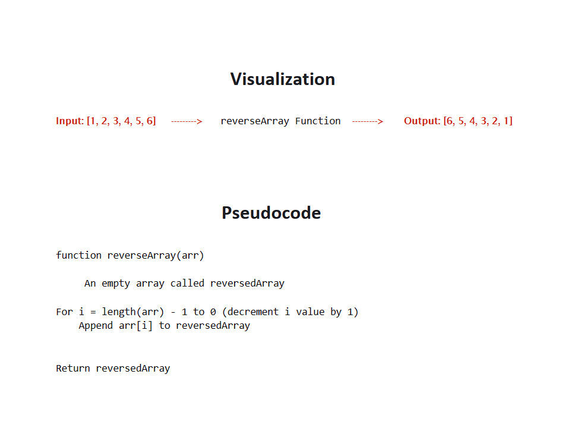

# Code Challenge 1: Reverse Array

---

**About the Challenge**
> Write a function called reverseArray which takes an array as an argument. Without utilizing any of the built-in methods available to your language, return an array with elements in reversed order.

----

**whiteboard**


----


**Approach & Efficiency**

For the approch I used for loop.
1. Create an empty array called reversedArray.
2. Start a loop that iterates from the last index (arr.length - 1) to the first index(0).
 **for each iteration:**
* Retrieve the element at the current index i from arr using arr[i].
* Append the element to reversedArr using reversedArray.push(arr[i]).
3. Return the reversedArr as the output.

----


**Solution**  

```javascript
function reverseArray(arr) {
  let reversedArray = []
  for (let i = arr.length - 1; i >= 0; i--) {
    reversedArray.push(arr[i]);
  }
  return reversedArray;
}
