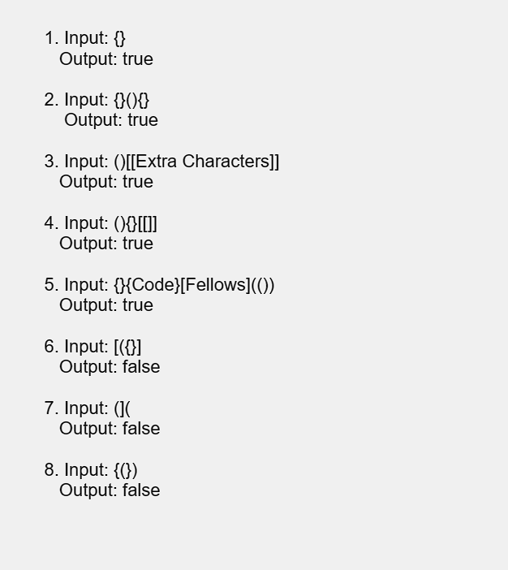

# Multi-bracket Validation.

----

**_Problem Domain_:**

> * Write a function that Validate Multi-bracket. Knowing that there are 3 types of brackets.
>1. Round Brackets : ()
>2. Square Brackets : []
>3. Curly Brackets : {}


----

**_Algorithm_:**

 Function called checkBrackets that takes a string as input and checks if the brackets in the string are balanced. It does this by extracting all the brackets from the input string (using regex ) and counting the number of opening and closing brackets for each type: (), [], {}. If the counts do not match or if the brackets are not properly opened or closed, the function returns false. Otherwise, it checks the adjacent pairs of brackets and verifies if they form valid combinations. If any invalid combination is found, the function returns false. If all the checks pass, the function returns true, indicating that the brackets are properly balanced.

----


**_Test cases & Visualization_:**




----

**_code_**

``` javascript
'use strict';

function checkBrackets(str) {

  let regex = /[^A-Za-z0-9!@#$%^&*\s]/ig;
  let arr = str.match(regex);

  let counter1 = 0;
  let counter2 = 0;
  let counter3 = 0;
  let counter4 = 0;
  let counter5 = 0;
  let counter6 = 0;

  arr.forEach(element => {
    if (element === '(') counter1++;
    if (element === ')') counter2++;
    if (element === '[') counter3++;
    if (element === ']') counter4++;
    if (element === '{') counter5++;
    if (element === '}') counter6++;
  });

  if (counter1 !== counter2) return false;
  if (counter3 !== counter4) return false;
  if (counter5 !== counter6) return false;
  if (arr[0] !== '[' && arr[0] !== '{' && arr[0] !== '(' ) return false;
  if (arr[arr.length-1] !== ']' && arr[arr.length-1] !== '}' && arr[arr.length-1] !== ')') return false;

  let accepted = [ '[[' , '((' , '{{' , '))' , ']]' , '}}' , '()' , '[]' , '{}' , ')(' , '}{' , '][' ,  ')[' , '){' , '}(' , '}[' , '](' , ']{' ];
  for (let i = 0 ; i <arr.length; i++ ) {
    if(arr[i]+arr[i+1] === arr[i]+'undefined') break;
    let possiblity = arr[i] + arr[i+1];
    if (!accepted.includes(possiblity)) return false;
  }
  return true;
}
console.log(checkBrackets('{(})'));
```


**Note:** Hasan and I collaborated to solve this code challenge.
Rama contributed to the solution by figuring out the looping idea to count the brackets number and exclude non - balanced ones
and Hasan contributed by figuring out the acceptable patterns and checking if our string matches them 

----