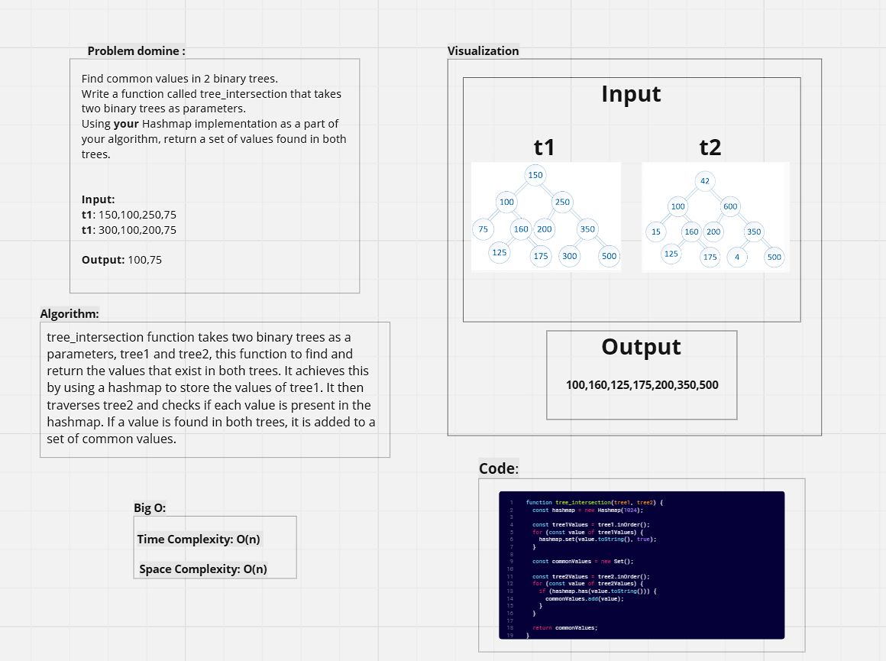
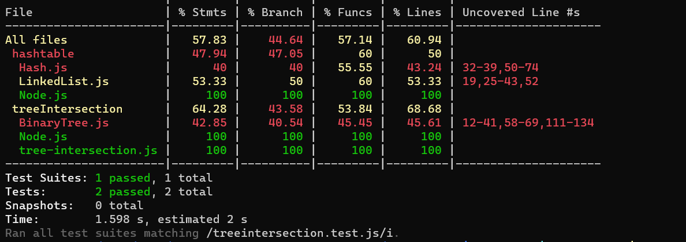

# Tree_intersection

----

**WhiteBoard:**




----

**Code:** 

```javascript

 function tree_intersection(tree1, tree2) {
  const hashmap = new Hashmap(1024);

  const tree1Values = tree1.inOrder();
  for (const value of tree1Values) {
    hashmap.set(value.toString(), true);
  }

  const commonValues = new Set();

  const tree2Values = tree2.inOrder();
  for (const value of tree2Values) {
    if (hashmap.has(value.toString())) {
      commonValues.add(value);
    }
  }

  return commonValues;
}

```

----

**Testing:**

```javascript
const { BinarySearchTree } = require('./BinaryTree');
const tree_intersection = require('./tree-intersection');

describe('tree_intersection', () => {
  it('should return common values between two binary trees', () => {
    // Create two binary trees
    let tree1 = new BinarySearchTree();
    tree1.add(10);
    tree1.add(20);
    tree1.add(30);

    let tree2 = new BinarySearchTree();
    tree2.add(20);
    tree2.add(30);
    tree2.add(40);

    const result = tree_intersection(tree1, tree2);

    expect(result.has(20)).toBeTruthy();
    expect(result.has(10)).toBeFalsy();
  });


  it('should return an empty set if no common values', () => {
    const tree1 = new BinarySearchTree();
    tree1.add(5);
    tree1.add(10);

    const tree2 = new BinarySearchTree();
    tree2.add(15);
    tree2.add(20);

    const result = tree_intersection(tree1, tree2);

    expect(result.size).toBe(0);
  });
});
```
----

