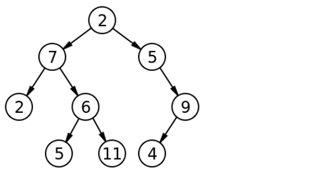

# tree-breadth-first


**_Problem Domain_:**

Write a function called breadth first, return list of all values in the tree, in the order they were encountered
NOTE: Traverse the input tree using a Breadth-first approach

**input:**
tree

**output:** Array having list of all values in the tree using Breadth-first approach


----

**_Algorithm_:**

 Method called breadthFirst() to visit all the nodes in a binary tree. It starts from the top (root) of the tree and goes down one level at a time, visiting all nodes at each level before moving to the next level. It does this by using a "queue" to keep track of the nodes it needs to visit. It starts with the root node in the queue, and then it takes one node at a time from the front of the queue, visits it, and adds its children to the back of the queue. This process continues until all nodes have been visited, and it returns the values of the nodes in the order they were visited.

----

**_Test cases & Visualization_:**

**input:**


**output:** [2,7,5,2,6,9,5,11,4]

----

**Code:**

```javascript
'use strict';

const {BinarySearchTree} = require('../tree-cc1/BinaryTree');

class TreeBreadthFirst extends BinarySearchTree{

  breadthFirst() {
    if (!this.root) {
      return [];
    }

    const queue = [];
    const result = [];

    queue.push(this.root);

    while (queue.length > 0) {
      const currentValue = queue.shift();
      result.push(currentValue.value);

      if (currentValue.left) queue.push(currentValue.left);
      if (currentValue.right) queue.push(currentValue.right);
    }

    return result;
  }
}

module.exports=TreeBreadthFirst;

 ```