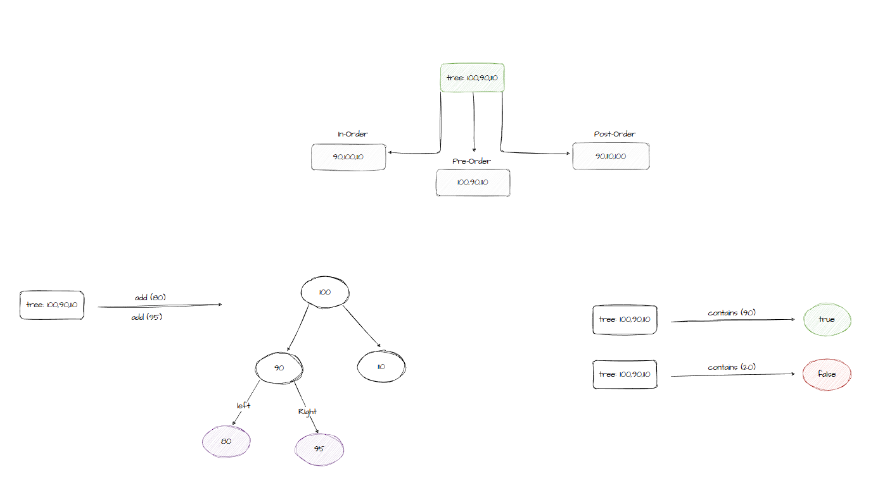
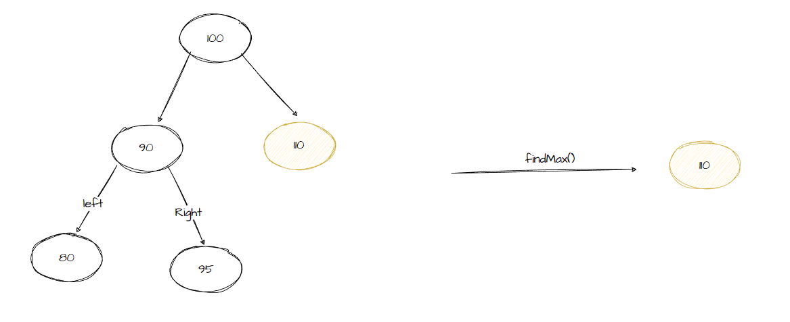

# Trees

----

**_Problem Domain_:**

Create a Node class that has properties for the value stored in the node, the left child node, and the right child node.
Binary Tree

Create a Binary Tree class
Define a method for each of the depth first traversals:
**pre order**
**in order**
**post order**
Each depth first traversal method should return an array of values, ordered appropriately.

Create a Binary Search Tree class
This class should be a sub-class of the Binary Tree Class, with the following additional methods:

**Add method:** Arguments: value, Return: nothing.Adds a new node with that value in the correct location in the binary search tree.

**Contains method:** Argument: value.Returns: boolean indicating whether or not the value is in the tree at least once.

**Added for code challenge #16:** method for the Binary Tree class to find maximum value, taking arguments as none and returns number, which is the maximum value stored in the tree.

----

**_Algorithm_:**

* Create a Binary Tree class: 3 methods each of the depth first traversals:

 **Pre-order:** root >> left >> right
 **Post-order:** left >> right >> root
 **In-order:** left >> root >> right

Each depth first traversal method should return an array of values, ordered appropriately.

* Create a Binary Search Tree class as a sub-class of the Binary Tree Class, with  these additional methods:

**Add**

Taking value: Adds a new node with that value in the correct location in the binary search tree. If the added value is smaller than the root (for each sub-tree) it's will be added to the left. If the added value is greater than the root (for each sub-tree) it's will be added to the right.

**Contains**

Taking value and returns boolean indicating whether or not the value is in the tree at least once. If the value is existing inside the tree return true, else return false.

**findMax**

Taking arguments as none and returns number, which is the maximum value stored in the tree.


----


**_Test cases & Visualization_:**



**Added for code challenge #16:**



----

**_Node class code:_**

``` javascript
'use strict';

class Node{
  constructor(value){
    this.value = value;
    this.left = null;
    this.right = null;
  }
}

module.exports = Node;
```

----

**_BinaryTree & BinarySearchTree class code:_**

``` javascript
'use strict';

const Node = require('./Node');

class BinaryTree{
  constructor(root = null){
    this.root = root;
  }

  // Pre-order: root >> left >> right
  preOrder(){
    let arr = [];
    const traversal = node => {
      arr.push(node.value);
      if(node.left) traversal(node.left);
      if(node.right) traversal(node.right);
    };

    traversal(this.root);
    return arr;
  }

  // Post-order: left >> right >> root
  postOrder() {
    let arr = [];
    const traversal = node => {
      if(node.left) traversal(node.left);
      if(node.right) traversal(node.right);
      arr.push(node.value);
    };

    traversal(this.root);
    return arr;
  }

  // In-order: left >> root >> right
  inOrder() {
    let arr = [];
    const traversal = node => {
      if(node.left) traversal(node.left);
      arr.push(node.value);
      if(node.right) traversal(node.right);
    };

    traversal(this.root);
    return arr;
  }
  
//Added method for code challenge #16
    findMax(){
    const preOrderArray = this.preOrder();

    // return Math.max(...preOrderArray); // this is the solution using a built in method

    let maxValue = preOrderArray[0];

    for (let i = 0; i <= preOrderArray.length; i++) {
      if (preOrderArray[i] > maxValue) {
        maxValue = preOrderArray[i];
      }
    }
    return maxValue; // same result using for loop 
  }
}


class BinarySearchTree extends BinaryTree{
  constructor(root){
    super(root);

  }

  add(value){

    let newNode = new Node(value);

    if(this.root === null){
      this.root = newNode;
    } else{

      let currentVal = this.root;
      while(value !== currentVal.value){

        if(value < currentVal.value){
          let newNode = new Node(value);
          if (currentVal.left) currentVal = currentVal.left;
          else {
            currentVal.left = newNode;
            return;
          }
        }

        if(value > currentVal.value){
          let newNode = new Node(value);
          if (currentVal.right) currentVal = currentVal.right;
          else {
            currentVal.right = newNode;
            return;
          }
        }
      }
      return 'This is an existing value!';
    }
  }

  contains(value){

    let currentVal = this.root;
    if (currentVal.value === null) return false;
    else if (currentVal.value === value) return true;

    while (currentVal.value !== value) {

      if (value > currentVal.value) {
        if (currentVal.right) currentVal = currentVal.right;
        else return false;
      }

      if (value < currentVal.value) {
        if (currentVal.left) currentVal = currentVal.left;
        else return false;
      }
    }

    return true;
  }
}


module.exports ={
  BinaryTree,
  BinarySearchTree
};
```


----
**Write tests to prove the following functionality:**

1. Can successfully instantiate an empty tree
2. Can successfully instantiate a tree with a single root node
3. For a Binary Search Tree, can successfully add a left child and right child properly to a node
4. Can successfully return a collection from a pre-order traversal
5. Can successfully return a collection from an in-order traversal
6. Can successfully return a collection from a post-order traversal
7. Returns true	false for the contains method, given an existing or non-existing node value
8. **Added test case for code challenge #16:** Find the maximum value stored in the tree


**All the tests --> passed**